# DevPrivSecOps methodology

## Introduction

This methodology will allow the internal developers of the project to bring the right practices in the lifecycle of the software developed during the project. Especially, and considering that the DevOps methodology is known and applied by most of the developers, efforts have been directed to the implementation of security and privacy within the DevOps methodology.

In response to the growing emphasis on privacy considerations, aerOS proposes the integration of privacy controls into the existing DevSecOps methodology, leading to the development of DevPrivSecOps. This novel approach aims to advance beyond the current industry standard and will incorporate privacy requirements, enabling aerOS developers to design software that is both secure and privacy-conscious from the beginning of the process.

Specifically, the DevPrivSecOps methodology designed aims to make project developments secure and privacy-aware by default. To this end, a series of tests have been designed and implemented that are executed automatically and manually to analyse and detect any security or privacy problems that the developed code may have. To implement this methodology, some open-source tools have been selected and some of them have been modified according to the needs of the project. In addition, user guides with examples have been included in the project repository to make it easier for developers to implement the DevPrivSecOps methodology designed in aerOS.

This methodology is intended to teach, not only aerOS developers, but also the entire software development landscape how to implement it. For this reason, the deliverable is public, and anyone interested will have access to it.

## DevPrivSecOps toolset implementation

Figure below shows the CI/CD pipeline that has been designed to implement the methodology and the tools that have been used in each step of this pipeline: GitLab, GitLeaks, Semgrep, SonarQube, Retire.js, Trivy, Flux CD, ZAP proxy and GDPR checklist.

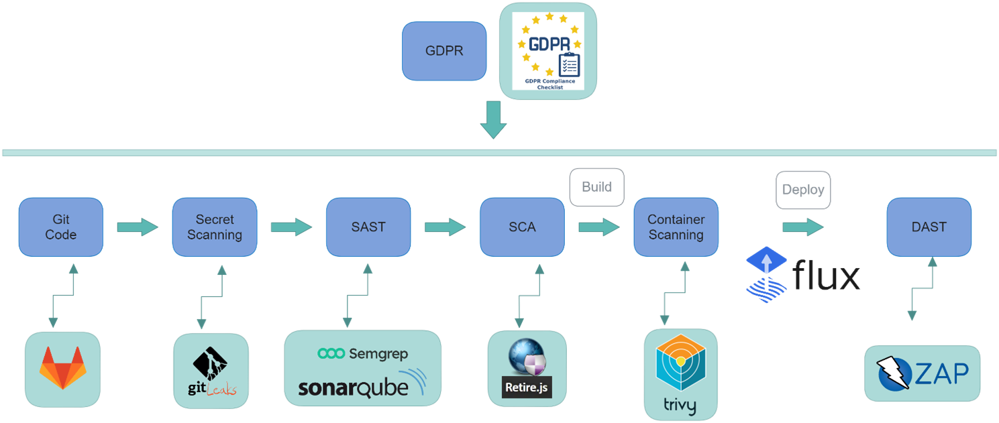

Gitlab, in addition to the software version control repository, is in charge of launching the different steps through the CI/CD pipeline configuration. The steps taken to implement the DevPrivSecOps methodology are as follows:

- **Secret Scanning**: GitLeaks has been used to scan if secrets have been included in the code. This tool allows us to analyse the code for privacy compliance, ensuring that user data is not accessible to people who have access to the repository.
- **SAST**: Static testing is performed once the software has been uploaded to the change control repository. These tests allow to analyse the vulnerabilities and security problems that the code may have. Semgrep and SonarQube will be used for this purpose in the project.
- **SCA**: Retire.js has been implemented for the implementation of Software Composition Analysis tests in the project. This test analyses the dependencies of the code, looking for any kind of security risks such as vulnerability dependencies.
- **Container Scanning**: Trivy has been implemented in order to be able to analyse the traceability of containerised components. Since most of the components of the project are containerised, it was decided to implement this test which complements the others.
- **Continuous Deployment**: In aerOS, it has been decided to use Flux CD as the continuous deployment component of the software developed in the project. This SW is dedicated to monitoring the changes in the master branch of the repositories, and when it detects any type of change in these, it updates the component in the production environment of the pilots.
- **DAST**: ZAP has been chosen to perform dynamic tests on the components deployed in the pilot environment. This tool enables security tests to be carried out on the components deployed, thus detecting security flaws in them.
- **GDPR**: In order to analyse GDPR compliance in software development, a check-list has been used in the project to analyse the status of compliance in the different phases.

In the following sections, the tools mentioned, and others that were used to implement the DevPrivSecOps methodology will be analysed in more detail and guidelines for the use of these tools will be provided in the form of examples.

### Cookbook

A [cookbook](./cookbook/aerOS_DevPrivSecOps_CB.pdf) has been written to present an implementation guide for the DevPrivSecOps methodology designed within the aerOS project.

In addition, this repository contains an [example of Gitlab CI/CD pipeline](./gitlab-ci-cd-pipeline-example.yml) that allows the implementation of the defined DevPrivSecOps methodology in aerOS.

[](https://www.youtube.com/watch?v=38o_GrY8w_E)

## Collaboration and communication tool: Mattermost

Mattermost is an open-source online chat service mainly focused on companies and organisations. This service, which is hosted on the UPV partner's servers and is publicly accessible through the URL https://mattermost.aeros-project.eu/, allows to create communication channels according to a topic, follow messages through threads or start private conversations with other users. The main purpose of Mattermost in the aerOS project is to offer a robust, secure and highly available communication system between all the partners involved.

## Source version control and CPD: GitLab

A dockerized instance of the Community Edition version of GitLab, which is being constantly being updated to avoid security issues, was installed in the private infrastructure of the UPV partner. This Gitlab repository can be accessed through the public URL https://gitlab.aeros-project.eu/, as well as its API, and the container registry of aerOS (registry.gitlab.aeros-project.eu).

## Secret Scanning: GitLeaks

GitLeaks is a SAST tool for detecting and preventing hardcoded secrets like passwords, API keys, and tokens in git repositories. This tool allows us to analyse the privacy of the code by identifying any personal data (such as passwords) that is hardcoded in the code uploaded to the repository.

As well as having privacy implications, the inclusion of passwords, API keys and tokens in the code can open a security breach allowing potential attackers to gain access to the application by using them.

To deploy GitLeaks in the repository to be analysed, the configuration shown in the next figure needs to be added to the `.gitlab-ci.yml` file.

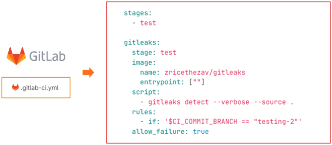

As shown in the figure above, the configuration must define the GitLeaks docker image that must be used to implement the test, the command that must be launched (in the script section) and finally the rule that must be fulfilled to launch the test. In this case, the rule is that the repository to be monitored (testing-2) must have a commit. This rule will automatically launch the GitLeaks test every time a commit is made to the repository being monitored, thus analysing the hardcoded secrets.

It should be noted that GitLeaks allows to add custom rules to be able to perform specific code analysis. In principle, the default GitLeaks configuration will be used in aerOS, but it will be analysed which specific rules should be included in specific repositories of the project.

Gitleaks provides a way to mitigate the case where we have leaks in our code, so that we can automate this process when we do have leaks.

## SonarQube

SonarQube is a source code evaluation platform. It is a free software, and it uses several static source code analysis tools such as Checkstyle, PMD or FindBugs to obtain metrics that can help improve the quality of a code.

The continuous code quality inspection offered by SonarQube is used to perform automatic reviews with static code analysis to detect bugs and code smells in 19 programming languages. SonarQube provides reports on duplicate code, coding standards, unit tests, code coverage, code complexity, comments, bugs, and security recommendations.

For the aerOS project, it has been decided to deploy the Docker version of the community edition of SonarQube on a server provisioned for these functions in the project.

SonarQube can be integrated with GitLab, via runners.

Before the runner can be launched, it must be registered on the machine where SonarQube is installed, so that it can be linked to the GitLab repository where we want to launch the tests (see th following figure). The CI/CD section of the GitLab repository provides the commands and steps to run on the machine.

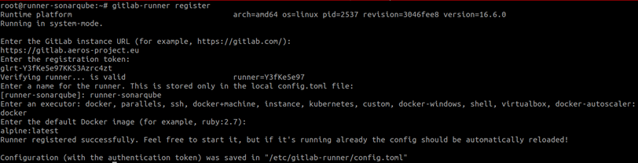

Finally, a project must be created using the SonarQube GUI that is associated with the GitLab repository to be analysed.

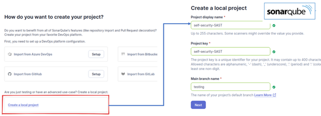

Once everything is installed, the environment variables must be added to the GitLab repository so that it can connect to SonarQube. Finally, a file with the SonarQube properties must be created in the repository.

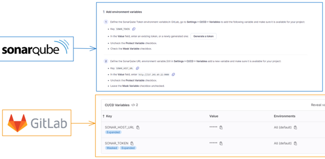


Once the runner is configured, every time a commit is made to the repository selected to be analysed, the runner will automatically launch the SAST analysis by connecting to the SonarQube server.

## Semgrep

Semgrep is an open-source static analysis tool used to help improve the quality of code by detecting bugs, enforcing coding standards and identifying security vulnerabilities. It's a semantic code grepper, meaning it can search code for patterns that look like bugs or coding violations, rather than just matching exact strings. It works with a variety of programming languages, including Python, JavaScript, Go, Java, Ruby and Typescript, and it aims to support more languages in the future.

Semgrep performs scans on a whole project either on-demand or automatically during every build or commit in CI/CD, with all analysis conducted locally. In aerOS, to comply with the principles of DevPrivSecOps, it will be integrated with Gitlab using runners to scan the project's source code for issues.

As in the SonarQube deployment, we must link the runner to the repository that we want to use. The next step is the registration process that allows the runner to access and execute the Gitlab CI/CD pipeline defined in the repository. This pipeline includes the steps to run tests using Semgrep. The following figure shows the runner registration on the system hosting Semgrep in order to run the build jobs and send the results back to Gitlab.

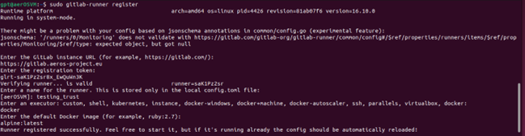

Once this is done, we can now move on to configuring the GitLab CI/CD pipeline. In this phase, we need to edit the `.gitlab-ci.yml` file to run SAST using Semgrep. This file allows developers to write specific instructions for GitLab CI/CD on how to build and test their application. If GitLab CI/CD is enabled, every commit to the repository automatically triggers the pipeline described in this file. This configuration specifies what should happen in the GitLab CI/CD pipeline when the code is pushed or merged.

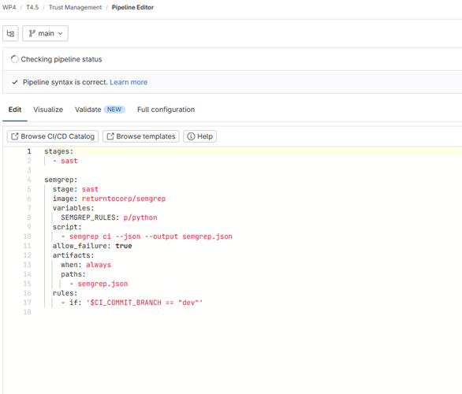

In the Figure depicted above, a job named *semgrep* has been established within a SAST stage, utilizing the Semgrep tool in a pre-built Docker container to scan Python code for security issues. The results of the scan are stored in the semgrep.json file. This job is specifically configured to run only when changes are made to the 'dev' branch. The pipeline will not fail even if Semgrep finds issues, ensuring continuous integration flow remains uninterrupted.

Once the changes to the `.gitlab-ci.yml` file are committed, the runner will automatically initiate the SAST analysis using the returntocorp/semgrep Docker image to execute Semgrep scans.

## Container Scanning: Trivy

Although containers provide an efficient and scalable way to develop and deploy applications, they can also present a risk if not operated correctly. Container images that have not been verified or analysed may contain malware, unpatched vulnerabilities or insecure configurations that can be exploited by malicious actors.

For this reason, container image analysis should be an essential element in the software development lifecycle. By systematically scanning and analysing container images prior to deployment, we can identify and remediate any potential threats, thus ensuring a secure and robust environment.

Trivy is an open-source container vulnerability scanning tool. It is very effective at finding vulnerabilities in both container images and dependencies in source code projects. These are the strengths of Trivy:

- **Container image scanning**: Trivy can scan container images for vulnerabilities. It supports several container image formats, including Docker and Kubernetes. It can detect vulnerabilities in operating system packages and libraries included in container images.
- **Project dependency analysis**: Trivy can also scan-source code projects for dependencies. It supports many programming languages and package managers.
- **Vulnerability database**: Trivy maintains an open-source vulnerability database that is regularly updated. This means that we can obtain information about the latest known vulnerabilities.

In order to include the Trivy analysis in the GitLab CI/CD pipeline, it is necessary to add the following lines (see next figure) in the `.gitlab-ci.yml` file, once the image of the container is builded.

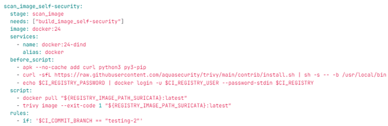

Once the container image has been generated, Trivy, which has been deployed on the machine where the GitLab runner is configured, will scan this newly created image. It will scan for any vulnerabilities that the image may have, and it will also scan the dependencies that the image has, trying to find any known vulnerabilities in its updated database.

## Flux CD

[FluxCD](https://fluxcd.io/) is a set of Continuous Delivery (CD) tools and solutions for Kubernetes under the umbrella of the CNCF. CD is a pattern focused on producing, releasing and deploying software in short cycles, following pipelines to ensure it is built, tested and released faster and more frequently.

This allows to reduce risk and for a more constant delivery of updates, thus testing the changes in a more controlled and incremental way.

FluxCD provides a GitOps Toolkit to follow the GitOps approach, a way of implementing CD. The concept of GitOps is to have a Git repository that always contains declarative descriptions of the desired state of the infrastructure/application in the production environment and an automated process to ensure that the production environment matches such state. GitOps allows the developer to deploy or update an application by simply updating the associated repository, and the automated process handles the rest, saving time and securing that the repository adequately describes the current state of the application, acting as a single source of truth.

For the aerOS project, the FluxCD solution has been chosen to handle the CD process, due to it fitting with the current Kubernetes infrastructure of the project.

There is a set of core concepts to learn about to properly understand how FluxCD operates, extensively explained in.

A **Source** defines the origin of a repository containing the desired state of the system and the requirements to obtain it. For example, a certain branch, a tag, etc. Sources are checked for changes on a defined interval and, if there is a newer version available, an artefact is produced.

**Artifacts** are objects that describe the changes and are consumed by other Flux component to perform actions, such as updating the cluster, to match the desired state.

**Reconciliation** refers to the process of ensuring that an application within the cluster or infrastructure matches a state as defined in the Source.

A **Kustomization** represents a set of Kubernetes resources that Flux is supposed to reconcile in the cluster.

A **Bootstrap** is the process of installing the Flux components in a GitOps manner.

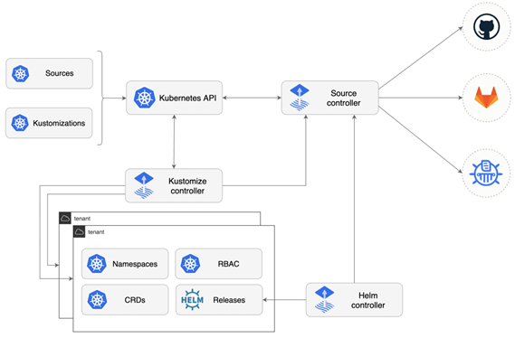

FluxCD can be integrated with GitLab by applying the following steps:

The process begins by generating a GitLab Access Token with read and write permissions to the API by accessing the User settings/Access tokens and selecting to create a new token, then export it in the system.

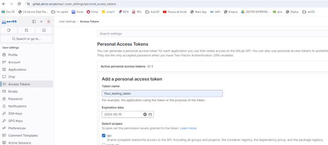

```bash
export GITLAB_TOKEN=<your-token>
```

Before proceeding, it can be checked that everything is ready to be ran and deployed by flux with flux check.

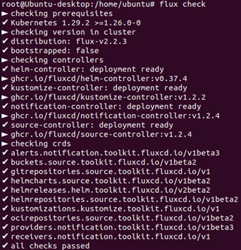

With the token ready, the next step is to run the GitLab bootstrap with the command flux bootstrap gitlab.

```bash
flux bootstrap gitlab \
  --token-auth \
  --hostname=my-gitlab-enterprise.com \
  --owner=my-gitlab-group \
  --repository=my-project \
  --branch=master \
  --path=clusters/my-cluster
```

As an example, here is the configuration used for the aerOS project flux test.

```bash
flux bootstrap gitlab \
  --token-auth \
  --hostname=gitlab.aeros-project.eu \
  --owner=p26-nasertic \
  --repository=flux-test \
  --branch=master \
  --path=./images/clusters/my-cluster
```

If everything worked correctly, the Controller pods should have deployed within the Kubernetes cluster. It may be verified by checking the pods in the flux-system namespace.

The Flux repository should have also been created with the manifests pushed to GitLab.

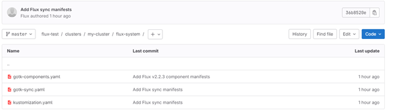

## DAST: ZAP

Dynamic Application Security Testing (DAST) involves examining a live web application for vulnerabilities by simulating an attacker's approach. It plays a crucial role in the DevPrivSecOps lifecycle. This black-box testing method aims to identify and exploit weaknesses as an actual attacker would, using either manual efforts or automated tools. DAST tests the application from an external perspective, allowing testers to disregard the internal mechanisms of the application and focus on pinpointing vulnerabilities that are most likely to be exploited by attackers. The insights from DAST typically highlight critical vulnerabilities that do not require insider knowledge to exploit, thereby prioritizing issues that need immediate attention. Although DAST is a valuable tool in the security testing, it does not replace other security testing methods. instead, it enhances them.

Integrating DAST into the development pipeline is essential for ensuring application security throughout various phases of software development, and in real-time. CI/CD pipelines streamline the software delivery process by automating tasks like code compilation, running tests, and deploying to production environments. Due to its need for a running application, DAST is optimally used within CI/CD pipelines, where it can effectively test applications in environments that mimic live production settings.

In the DevPrivSecOps, DAST tools are typically employed at multiple stages, especially during and after the development phase. These tools are designed for quick feedback, unlike traditional web application vulnerability scanners that might take hours to complete. This real-time analysis is crucial for identifying security weaknesses that might not be apparent during static analysis or code review.

OWASP ZAP (Zed Attack Proxy) is an open-source web application security scanner. Developed by the Open Web Application Security Project (OWASP), it is one of the most popular tools used for testing web applications, helping to identify security vulnerabilities during the development and testing phases of software development cycles.

ZAP provides automated scanners as well as a set of tools that allow you to find security vulnerabilities manually. It is designed to be user-friendly for beginners in application security, yet powerful enough for professional penetration testers. The most important key features of ZAP are:

- **Automated Scanner**: ZAP can perform both active and passive scanning. Active scanning involves ZAP automatically testing the application for vulnerabilities using known attack patterns. Passive scanning, on the other hand, monitors website traffic and analyses it for signs of potential security issues.
- **Intercept Proxy**: This function turns ZAP into a man-in-the-middle-proxy between the tester's browser and the web application, allowing the tester to intercept, inspect, and modify the traffic passing through.
- **Spider**: It uses a spider to crawl websites and automatically discover new resources (URLs)
- **Scanning**: It can passively scan traffic that passes through it without altering it, and it can also perform active scanning which sends modified data to the server to check for vulnerabilities.
- **REST API**: ZAP includes a REST API for interacting with the tool programmatically, which is useful for integrating ZAP into Continuous Integration namely CI pipelines.

OWASP ZAP is planned to be integrated into aerOS' GitLab repository to scan a running application in accordance with DevPrivSecOps regulations. Like the deployment of the SAST tools, it is necessary to link the runner with the repository intended for use. The registration of the runner will be foregone, as the runner previously registered during the Semgrep deployment will be utilized for testing purposes.

Proceeding with the configuration of the GitLab CI/CD pipeline. In this phase, it is necessary to modify the `.gitlab-ci.yml` file to implement DAST using OWASP ZAP. This file enables developers to specify detailed instructions for GitLab CI/CD on how to build and test their application.

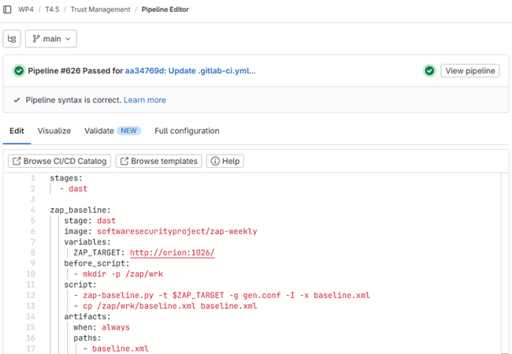

Analysing what is depicted in the above figure, within the *dast* stage, there is a job named *zap_baseline* configured to run using the *softwaresecurityproject/zap-weekly* Docker image.

The configuration sets an environment variable, ZAP_TARGET, which specifies the target URL of the web application to be tested.

## Privacy: GDPR compliance Checklist

The need to analyse privacy during the software development lifecycle has led aerOS to develop a GDPR compliance tool in the software development lifecycle. This tool is based on the GDPRchecklist tool and aims to analyse whether the tools developed in the project and specifically the tools used in the pilotss comply with this rule. This tool has been modified to meet the specific needs of the aerOS project.

Privacy and especially GDPR compliance is directly related to data and data usage. Therefore, aerOS aims, through this checklist to guide the developers and users of the pilots to comply with this regulation.

The tool is intended to guide developers in the correct use of private data in the different components that interact with them.

For end users, in the case of the pilots in the project, the aim is to analyse the types of data to be used and how they should be used correctly.

This tool has also recommendations on how to comply with the different sections of the GDPR law, thus guiding developers and users to comply with it.

As can be seen in the following figure, the use of data within the project is classified into three groups, depending on the different roles that are in charge of the data management:

- **Data controller**: the module in charge of controlling the data processing. In the case of the aerOS project, the Data Fabric oversees managing the continuum data.
- **Data Processor**: the ML models or data processing tools of the pilots are part of this group in the aerOS project.
- **Data subject**: in this case, the data provider is analysed. In the context of the project, all data sources that are connected to the aerOS continuum are analysed in this section.

These roles are assigned to each of the questions asked in the different groups of the checklist: data, accountability and management, new rights, special cases and user rights.

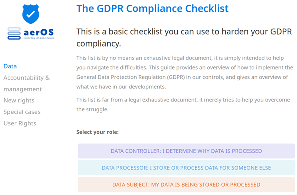

The checklist is divided into 4 main sections: Data, Accountability and management, new rights and user rights.

### Data

By means of this analysis, the aim is to see whether the processing of the pilot data by the Data Fabric complies with the GDPR regulation, or if something needs to be changed in this tool to make it compliant.

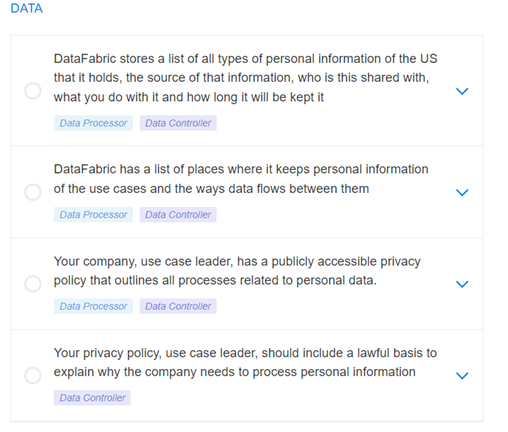

### Accountability and management

In this section it is analysed that the environment, in this case aerOS, is safe and that any problems are reported to the authorities correctly. This is measured with the checkboxes shown in the next figure.

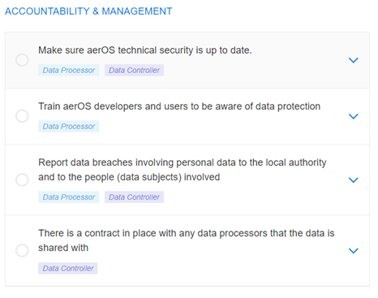

### New rights

By means of the checklist shown in the following figure, it is intended to ensure that aerOS users, and in particular data providers to the continuum, are always in control of their data and can modify or delete it at any time.

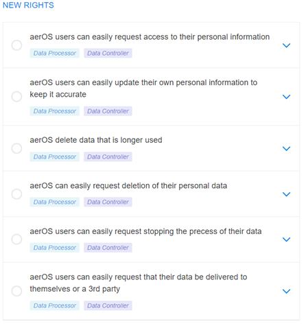

### User rights

This section analyses that the rights of the providers of the data used in the continuum are always complied with. Next figure shows the sections to be fulfilled by aerOS to comply with the GPDR regulation.

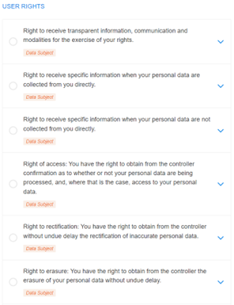

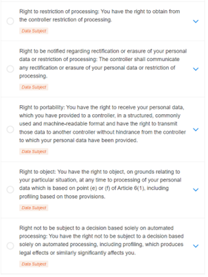
